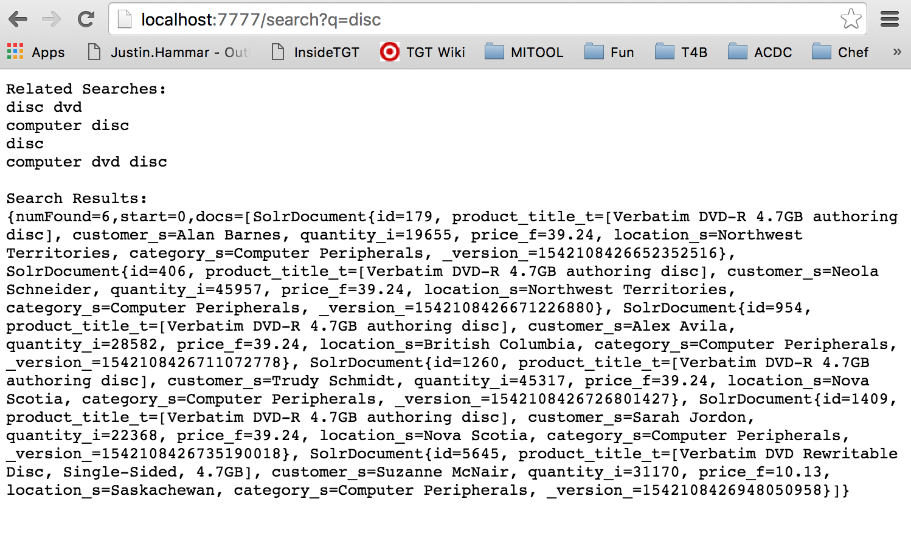
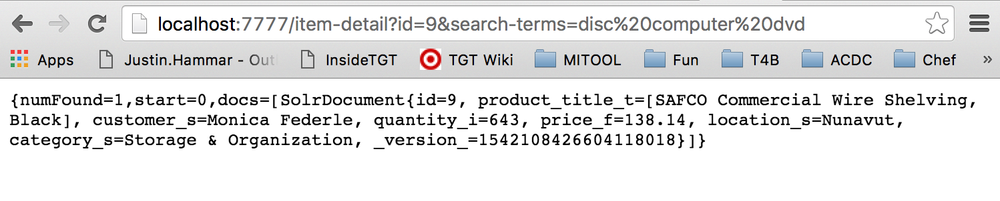
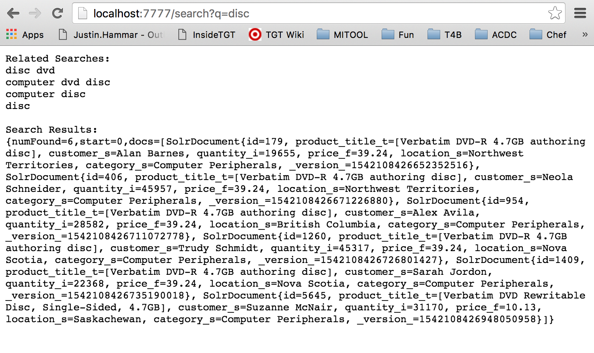

#Solr Related Search

This project recreates the "related search" feature on Google shown below.

As you can see, if "space mission" isn't turning up the results you want, you might want to try the related search of "space mission to mars" that Google suggests.

So what's going on under the hood? The core of my algorithm is built on a simple premise: if someone searches for "space mission to mars" and clicks on one of the search results, we assume that search was helpful and increment its "helpfulness" score. Then if someone does a search using a subset of those terms (e.g. "space mission"), then "space mission to mars" might appear on the list of searches related to "space mission".  The higher a search's helpfulness score, the higher on the list it'll be. Further below, you'll find more detail on the algorithm.

##Setup

To see this Related Search feature in action, follow these steps. Or you can just skip down to the demo section and observe the screenshots of it in action.

1. Download solr-related-search.zip and unzip it.
2. Make sure you have stopped any running instances of Solr on your computer (this zip file comes with its own instance of Solr that we will use.
3. Cd into the directory and run setupRelatedSearch.sh
4. You should see Solr start up as well as the simple server my code uses.
5. When you see `Building 75% > :runFinalJar`, you can start trying out Related Search

##Demo
Open your browser and go to `http://localhost:7777/search?q=disc`. This will give you the response of a standard Solr search for "disc" in addition to a list of searches related to "disc". You'll notice that "computer dvd disc" is last on the list.

Open another browser tab and go to `http://localhost:7777/item-detail?id=9&search-terms=disc computer dvd`. This will show you the details for the item with id 9 and it increase the score of the search query "disc computer dvd". The idea is that when you click on a search result, it'll show you the item details and remember that "disc computer dvd" was a successful query. Refresh the page so that we add another point to this search term.

Navigate back to `http://localhost:7777/search?q=disc`. You'll see that "computer dvd disc" went up in the list because we increased its score with a successful query. You'll also notice that it treated "computer dvd disc" and "disc computer dvd" as the same query because the order of the terms doesn't matter.

##The Algorithm in More Detail

My project consists of a simple HTTP server with two GET endpoints: /search and /item-detail. When the /search endpoint is hit (e.g. `http://localhost:7777/search?q=space mission`), it'll take the "q" parameter that is passed in the GET and use that to perform a standard search query on the "sample-items" core of the local Solr instance (this core contains a mock item database) in order to provide search results to the user. In addition, this endpoint will use that "q" parameter to query the "related-search" Solr core in order to find search strings related to the current search string q. To accomplish this, the algorithm prepends each word in the search string with a plus sign so as to make it required in the following Solr query (words that already start with a plus sign don't get an extra one and words that start with a minus sign are left as is so that that word can't appear in any of the related-search strings). Then, this list of related searches is sorted by their helpfulness score. Finally, this related search list and the regular search results are returned to the caller (presumably a web page).

Now, on the search result web page, the idea is that every search result will be a link that points at the /item-detail endpoint (e.g. `http://localhost:7777/item-detail?id=9&search-terms=space mission`). The "id" parameter tells us which item's details to return and the "search-terms" parameter tells us the search string that generated this search result that the user now wants the details of.  First, the algorithm queries the "sample-items" Solr core using the provided id so that we can pass it back to the caller. Additonally, it'll increment the helpfulness score of the "search-terms" search string in the "related-search" Solr core. To do this, we will once again prepend each word of the search string with a plus sign (except those that start with a plus or minus sign) to make those terms required in the query. Now the algorithm queries the "related-search" Solr core using our modified search string and it looks over the results. If the number of terms in one of those results is equal to the number of terms in our search string (not including terms with a minus sign), then this related-search string is equivalent to our search string (same terms but potentially in a different order, not including terms with a minus sign). In such a case, the algorithm will increment the helpfulness score field of that search string in the "related-search" Solr core.  If a match is not found, then it makes a new document in the "related-search" Solr core, using our search string but with any plus signs removed and with any minus sign terms removed. Finally, we return the item details to the caller (presumably a web page).
